Gajanan#17

Installation directory of codecomposer : /home/ganraj/ti/ccs1250

0\. Look at the section 5 : experimental evaluation in the 1^st^ paper
link :

https://dl.acm.org/doi/pdf/10.1145/3508352.3549451

1.  LED blinking code of MSP430

2.  To test timing of LeNet-5 in MSP430.

Prerequisites :

Proxy login : : https://proxy62.iitd.ac.in/cgi-bin/proxy.cgi

1.  Understand about <https://www.youtube.com/watch?v=k5FgMRrRm-c>

2.  https://www.youtube.com/watch?v=vn7TqU89e9o&list=PLRqKd7sGGKMTB5egcnNuR_SJjMgzFntKj&index=2

For Lab PC :

Workspace : /home/ganraj/workspace_v12

For my PC :

Workspace : /home/ganraj/ti/ccs1250

Problem occuring :

error initializing emulator msp-fet430uif is already in use . I am
clearing the msp430 board . I am updating the system. Facing issues with
proxy I guesss. Anyways doing just the thing to clear the msp430 board.
Still the error persists : seeing manuel :
<https://www.ti.com/lit/ug/slau678c/slau678c.pdf?ts=1701161921322&ref_url=https%253A%252F%252Fwww.google.com%252F>

Now I am installing the drivers for it. TI ACCOUNT :
<boradeganraj@gmail.com>, Gajanan#17

Installation directory of drivers : /opt/ti/fetdrivers . This is for
your pc too.

SO I DONOT KNOW WHAT I DID BUT IT GOT WORKING CORRECTLY : SO BASICALLY I
USED THE RESOURCE : <https://www.youtube.com/watch?v=H1HToCzku9Y>

{width="6.3125in"
height="3.65625in"}

I IMPORTED THE OUT OF BOX BLINK CODE . NOW LET ME CHECK THE OTHER THINGS
TOO. Basically you just install test packages which is being given to
you by TI. And then I found the code of LED blink and I found it and I
worked it out.

\-\--\> last thing which I did today is about the suming of the elements
of the array.

After coming to room and eating chicken lababdar with oil :

1.  [phdschooltpc/msp430-xor: Machine learning example running on
    MSP430. (github.com)](https://github.com/phdschooltpc/msp430-xor)

2.  [lucianobajr/internet-of-things: :robot: Internet Of Things
    (CCF 351)
    (github.com)](https://github.com/lucianobajr/internet-of-things)

3.  [CS249r :: Tiny Machine Learning (Fall 2022, Grad. Seminar) - Copy
    Final Projects
    (google.com)](https://sites.google.com/g.harvard.edu/tinyml/finalprojects?authuser=0#h.42412o3r6elt)

4.  [Machine Learning for Microcontroller-Class Hardware: A Review
    (arxiv.org)](https://arxiv.org/ftp/arxiv/papers/2205/2205.14550.pdf)

Day #2

1.  Code for finding the time :

    a.  #include \<msp430.h\>

    b.  

    c.  void main(void)

    d.  {

    e.  // Stop the Watchdog Timer

    f.  WDTCTL = WDTPW + WDTHOLD;

    g.  

    h.  // Enable the cycle counter

    i.  \_\_bis_SR_register(SCG0);

    j.  

    k.  // Your code or function to be timed goes here

    l.  for (int i = 0; i \< 1000; ++i) {

    m.  // Do some computation

    n.  }

    o.  

    p.  // Disable the cycle counter

    q.  \_\_bis_SR_register(SCG1);

    r.  

    s.  // Read the cycle count

    t.  unsigned int cycles = \_get_CYCLES();

    u.  

    v.  // Print the result

    w.  printf(\"Cycle count: %u\\n\", cycles);

    x.  

    y.  while (1);

    z.  }

Now for my device MSP430fr5994 : THE CLOCK FREQUENCY IS 16-MHz system
clock. But this code did not work facing compiling issues.

2.  Bhaiya itna aasan bhi nahi hai . I have to learn about timers in
    msp430 and all.
    <https://www.youtube.com/playlist?list=PL643xA3Ie_EuHoNV7AgvJXq-z1hrE8vsm>
    Need to look at this video series.

3.  Talked to nivedita mam, now able to print hello world.

4.  #include \<msp430.h\>

5.  #include \<stdio.h\>

6.  

7.  

8.  int main(void)

9.  {

10. WDTCTL = WDTPW \| WDTHOLD; // Stop WDT

11. 

12. configureUART();

13. 

14. // Configure GPIO

15. P1OUT &= \~BIT0; // Clear P1.0 output latch for a defined power-on
    state

16. P1DIR \|= BIT0; // Set P1.0 to output direction

17. 

18. PM5CTL0 &= \~LOCKLPM5; // Disable the GPIO power-on default
    high-impedance mode

19. // to activate previously configured port settings

20. 

21. // \-\-\-\-\-\-\-\-\-\-\-\-\-\-\-\-\-\-- STARING TIMER
    \-\-\-\-\-\-\-\-\-\-\-\-\-\-\-\-\-\-\-\-\--//

22. // Set up Timer A

23. volatile unsigned long start_time, end_time;

24. TA0CTL = TASSEL_2 + MC_0 + TACLR; // Use the SMCLK, stop the timer,
    and clear it

25. TA0CCR0 = 0xFFFF; // Set the timer\'s upper limit

26. 

27. // \-\-\-\-\-\-\-\-\-\-\-\-\-\-\-\-\-\-- MEMORY ALLOCATION STARTED
    \-\-\-\-\-\-\-\-\-\-\-\-\-\-\-\-\-\-\-\-\-\-\-\-\--//

28. volatile char count = 5, index, sum=0;

29. volatile char num\[\] = {1,2,3,4,5};

30. index = 0;

31. while(index \< count){

32. 

33. sum += num\[index\];

34. index++;

35. }

36. 

37. end_time = TA0R;

38. 

39. // Calculate and print the elapsed time

40. unsigned long elapsed_time = end_time - start_time;

41. 

42. printf(\"Hello world!\");

43. 

44. 

45. return 0;

46. /\*

47. while(1)

48. {

49. P1OUT \^= BIT0; // Toggle LED

50. //\_\_delay_cycles(2);

51. }

52. \*/

53. } \-\--\> working

```{=html}
<!-- -->
```
5.  We have to see time via register values only.

    a.  // Setup Timer_A

    b.  TA0CTL = TASSEL_2 + MC_1 + ID_3; // SMCLK, Up mode, divide by 8

    c.  TA0CCR0 = 2000; // Set the timer period for 1 ms (16 MHz / 8 /
        2000 = 1 ms)

6.  **TASSEL_2 (Clock Source):**

    a.  TASSEL_2 selects SMCLK (Sub-System Master Clock) as the clock
        source for Timer_A. SMCLK is often derived from the main system
        clock.

7.  **MC_1 (Mode Control - Up mode):**

    a.  MC_1 sets the timer to Up mode, where the timer counts up to the
        value in TA0CCR0 and then resets. This is a basic mode for
        generating a periodic interrupt or measuring time intervals.

**30/11/23**

1.  **WHOLE information about the clock :
    https://chat.openai.com/share/09ea156a-f421-4f47-a3ab-028f4e9fdbfd**

2.  The volatile keyword tells the compiler that the variable\'s value
    may change at any time without any action being taken by the code
    the compiler finds nearby. This prevents the compiler from
    optimizing away reads or writes to that variable, ensuring that the
    variable is always read from or written to memory, and not cached in
    a register.

3.  <https://www.youtube.com/watch?v=i66oTB8LPvw&list=PLRqKd7sGGKMTB5egcnNuR_SJjMgzFntKj&index=6>
    \-\-- \> learn about the serial communication between the device and
    the pc.

4.  see basically I am using msp430fr5994 And my code is hangling on the
    declarations : volatile unsigned int matrix1\[size\]\[size\];
    volatile unsigned int matrix2\[size\]\[size\]; volatile unsigned int
    result\[size\]\[size\]; . i DONOT KNOW WHAT TO Do :

    a.  The MSP430 series typically has limited RAM. If the matrices are
        too large, they may be causing a stack overflow. Consider
        allocating the matrices in a different memory segment, such as
        using malloc to allocate memory from the heap.

5.  <https://github.com/danaolcott/MSP430> \--\> for using python/java
    with code composer

6.  <https://github.com/ticepd/msp430-examples>

7.  Python + codecomposer :
    <https://github.com/cetic/python-msp430-tools/blob/master/doc/README-msp430-bsl.txt>

8.  I have this working code now :

9.  #include \<msp430.h\>

10. #include \<stdio.h\>

11. #include \<stdlib.h\>

12. #include \<string.h\>

13. 

14. int main(void)

15. {

16. WDTCTL = WDTPW \| WDTHOLD; // Stop WDT

17. 

18. // Configure GPIO

19. P1OUT &= \~BIT0; // Clear P1.0 output latch for a defined power-on
    state

20. P1DIR \|= BIT0; // Set P1.0 to output direction

21. 

22. PM5CTL0 &= \~LOCKLPM5; // Disable the GPIO power-on default
    high-impedance mode

23. // to activate previously configured port settings

24. 

25. // Setup Timer_A

26. TA0CTL = TASSEL_2 + MC_1; // SMCLK, Up mode (no input divider)

27. TA0CCR0 = 16000; // Set the timer period for 1 ms (16 MHz / 16000 =
    1 ms)

28. 

29. // Start Timer_A

30. TA0CTL \|= TACLR; // Clear Timer_A

31. TA0CTL \|= MC_1; // Start Timer_A in Up mode

32. 

33. 

34. /\* \-\-\-\-\-\-\-\-\-\-\-\-\-\-\-\-\-\-\-- INTITAL TESTED CODE FOR
    ADDITION AND DIVISION
    \-\-\-\-\-\-\-\-\-\-\-\-\-\-\-\-\-\-\-\-\-\-\-\-\-\-\-\--

35. volatile int a = 3, b=5;

36. volatile int c = a/b;

37. \-\-\-\-\-\-\-\-\-\-\-\-\-\-\-\-\-\-\-\-\-\-\-\-\-\-\-\-\-\-\-\-\-\-\-\-\-\-\-\-\-\-\-\-\-\-\-\-\-\-\-\-\-\-\-\-\-\-\-\-\-\-\-\-\-\-\-\-\-\-\-\-\-\-\-\-\-\-\-\-\-\-\-\-\-\-\-\-\-\-\-\-\-\-\-\-\-\-\-\--\*/

38. 

39. int size = 2;

40. for (;size \< 1000;size++){

41. 

42. int \*a = (int \*)malloc(size \* size \* sizeof(int));

43. int \*b = (int \*)malloc(size \* size \* sizeof(int));

44. int \*result = (int \*)malloc(size \* size \* sizeof(int));

45. int i = 0;

46. for (; i \< size; i++){

47. int j = 0;

48. for (j = 0; j \< size; j++){

49. \*(a + i\*size + j) = 1;

50. \*(b + i\*size + j) = 2;

51. \*(result + i\*size + j) = 0;

52. }

53. }

54. 

55. i=0;

56. for (;i\<size;i++){

57. int j = 0;

58. for (;j\<size;j++){

59. int k = 0;

60. 

61. \*(result + i \* size + j) = 0;

62. for (;k\<size;k++){

63. 

64. \*(result + i \* size + j) += \*(a + i \* size + k) \* \*(b + k \*
    size + j);

65. volatile int res = \*(result + i\*size +j);

66. }

67. }

68. }

69. 

70. free(a);

71. free(b);

72. free(result);

73. 

74. }

75. 

76. // Stop Timer_A

77. TA0CTL &= \~MC_1; // Stop Timer_A

78. 

79. // Calculate and print elapsed time

80. volatile unsigned int elapsed_time = TA0R;

81. 

82. /\*

83. 

84. // Assuming a 16 MHz system clock and a divide-by-8 prescaler

85. double clockFrequency = 16000000.0; // 16 MHz

86. double prescaler = 8.0; // Divide by 8

87. 

88. 

89. // Calculate the time period of one Timer_A count in seconds

90. double timerPeriod = 1.0 / (clockFrequency / prescaler);

91. 

92. // Convert Timer_A counts to actual time in seconds

93. volatile double actualTimeInSeconds = elapsed_time \* timerPeriod;

94. \*/

95. 

96. 

97. }

Now look at this source for energy plotting :
<https://webmail.iitd.ac.in/src/webmail.php>

01/12/23 :

Flash memory

Flash memory is used to store the programs and constant variables

The size of Flash memory in MSP430F2003 is 1 KB

The size of Flash memory in MSP430F2003 is 2 KB

RAM

RAM is used to store the temporary data (Read/Write memory)

The size of RAM in MSP430F2003 and F2013 is 128 Bytes

Basic Clock system :

The clock module provides the CLK for CPU and peripherals. Three clock
signals are

available from the basic clock module:

MCLK : Master clock is used by CPU and system

SMCLK : Subsystem Master clock is distributed to high speed peripherals

ACLK : Auxiliary clock is also distributed to low speed peripherals

IMp :
<https://maheshelectronics.files.wordpress.com/2020/05/mpmc_material345-units.pdf>

<https://github.com/phdschooltpc/msp430-xor> \--\> for neural network to
run onto msp board

<https://github.com/leleonardzhang/Capuchin> \--\> Important

<https://github.com/tejaskannan/budget-rnn> \--\> above and this paper
is for running neural network into the board.

Updates : matrix multiplication is not working fine for 3\*3 matrix . I
have used malloc but it is not happeniing.

<https://e2e.ti.com/support/microcontrollers/msp-low-power-microcontrollers-group/msp430/f/msp-low-power-microcontroller-forum/561317/msp430fr5994-writable-memory-above-64k>

2/12/23

<https://github.com/jamy54/Lenet_accelerator> \--\> **ABSOLUTELY IMP**

***[NOT USED :]{.underline}* Memory mapping issue :
<https://e2e.ti.com/support/microcontrollers/msp-low-power-microcontrollers-group/msp430/f/msp-low-power-microcontroller-forum/63459/msp430f5438-region-text-is-full>**

**3/12/2023 \-\--\> holiday**

**04/12/23 :**

1.  **Sir se mila \--\> board leliye**

2.  [MSP430 FRAM Technology -- How To and Best Practices (Rev.
    B)](https://www.ti.com/lit/an/slaa628b/slaa628b.pdf?ts=1701719984341&ref_url=https%253A%252F%252Fmobile-int.aws.ti.com%252F)
    \--\> look here for FRAM

05/12/23 : CGPA CAME AND MOVIE ANIMAL SEEN

06/12/23 :

1.  Memory allocation limit exceed : how ? \--\>
    <https://e2e.ti.com/support/microcontrollers/msp-low-power-microcontrollers-group/msp430/f/msp-low-power-microcontroller-forum/813093/ccs-msp430fr5994-how-to-solve-the-problem-array-is-too-large>

2.  In Code Composer Studio (CCS), a .cmd file is a linker command file.
    It is used by the linker during the build process to specify the
    memory layout of your program. The linker command file contains
    directives and commands that instruct the linker on how to organize
    and allocate the various sections of your program in the target
    memory.

3.  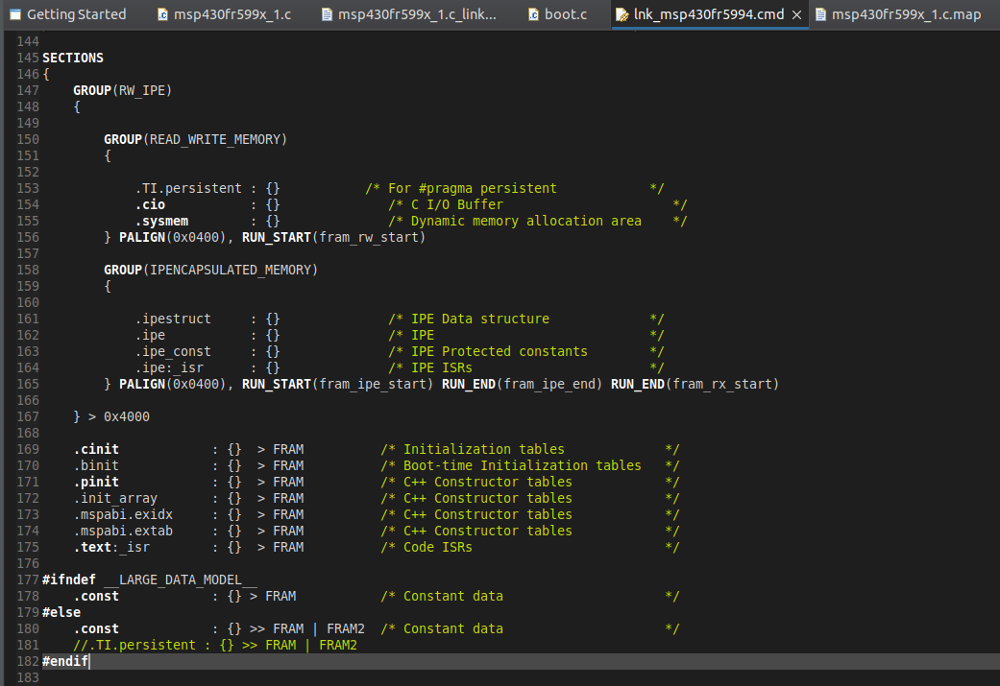{width="5.0in"
    height="3.4375in"}

4.  Here to use only FRAM data \--\>

    a.  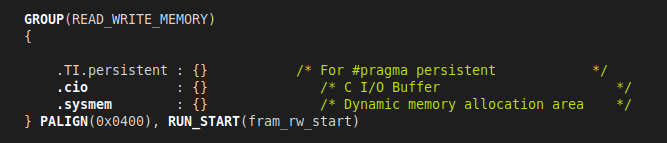{width="5.0in"
        height="1.0729166666666667in"}

    b.  BUT IF WE NEED TO ALLOCATE THE DATA TO FRAM2 : THEN COMMENT THIS
        LINE OF .TI.persistent : {} and then add : at 181 line :
        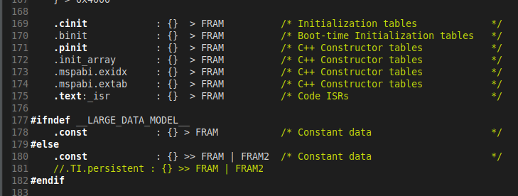{width="5.0in"
        height="1.8958333333333333in"}

    c.  Here the line is commented but you have to uncomment it \--\>
        for FRAM2 utilisation. Notice by this line, your data will now
        go to FRAM2 only and not in FRAM.

    d.  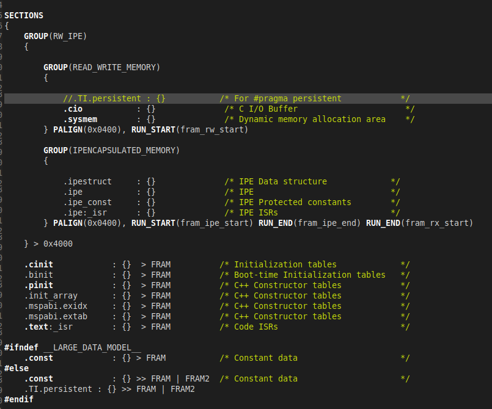{width="5.0in"
        height="4.166666666666667in"}

so this is the final configuration.

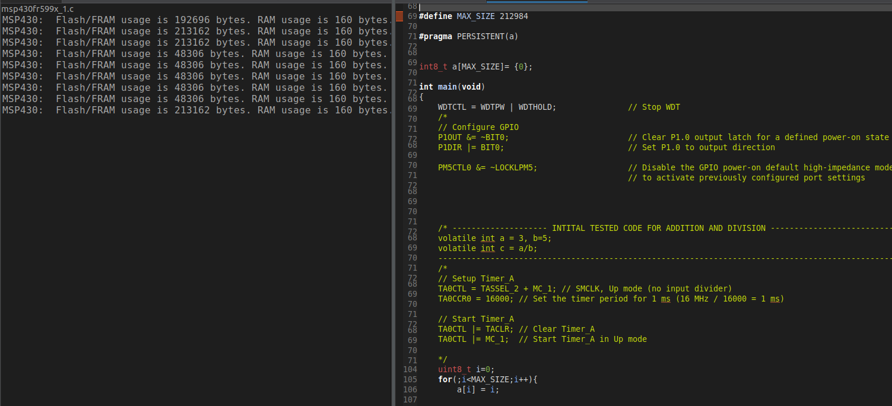{width="6.083333333333333in"
height="2.7628477690288715in"}

And in memory map the details are
:{width="5.0in"
height="0.19791666666666666in"}{width="5.0in"
height="0.3333333333333333in"}

> Address start length used ununsed
>
> So in fram2, I am using 212984 bytes of data as I have used uint8_t .
> You can see in above photo. And In FRAM, I am using 48128 bytes of
> data.
>
> Summarising : adding .TI.persistent : {} \>\> FRAM \| FRAM2 will first
> try to allocate memory in fram and if not then it will try to allocate
> memory in fram2.
>
> 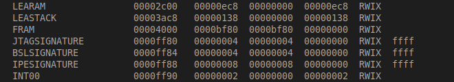{width="5.0in"
> height="0.90625in"}
>
> Wow, total utilization of fram as you can see above. With total size
> of array as 48996. Here but the problem is if I increase the size of
> 48997, then the allocation will happen in fram2. And the allocation in
> fram will not happen here in this case.
>
> I CAN 2 ARRAYS TO use total space :
>
> 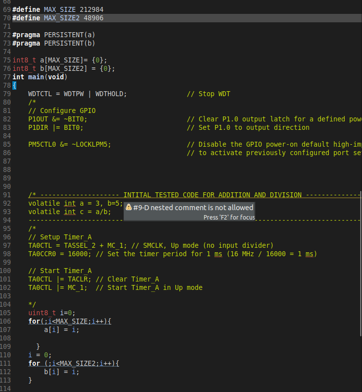{width="4.625in"
> height="5.0in"}
>
> 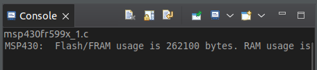{width="4.75in"
> height="1.0520833333333333in"}
>
> See so maximum size of one array is 212984 bytes which can be
> allocated in fram2 and in other fram, I can accommodate 48906 bytes.
>
> Accha here the thing is I am not using RAM or LERAM. Ok now I want to
> run TinyML here. Time taken badme dekhta hu. \-\--\> sarangi sir bole.
>
> 7/12 - 13/12/23 :

1.  [Neural networks -
    YouTube](https://www.youtube.com/playlist?list=PLZHQObOWTQDNU6R1_67000Dx_ZCJB-3pi)

2.  [Convolutional Neural Networks: CNN Basics -
    YouTube](https://www.youtube.com/playlist?list=PLxlkzujLkmQ8Ov11Xm-K913C7uNSfr5Rp)
    \-- \> till LeNet

3.  Above are done watching. That is learned basics of Neural network
    and CNN.

4.  [8. LeNet CNN - Complete Description and Implementation with Code.
    (youtube.com)](https://www.youtube.com/watch?v=PiF0l6xif-k) \-\--\>
    watching now

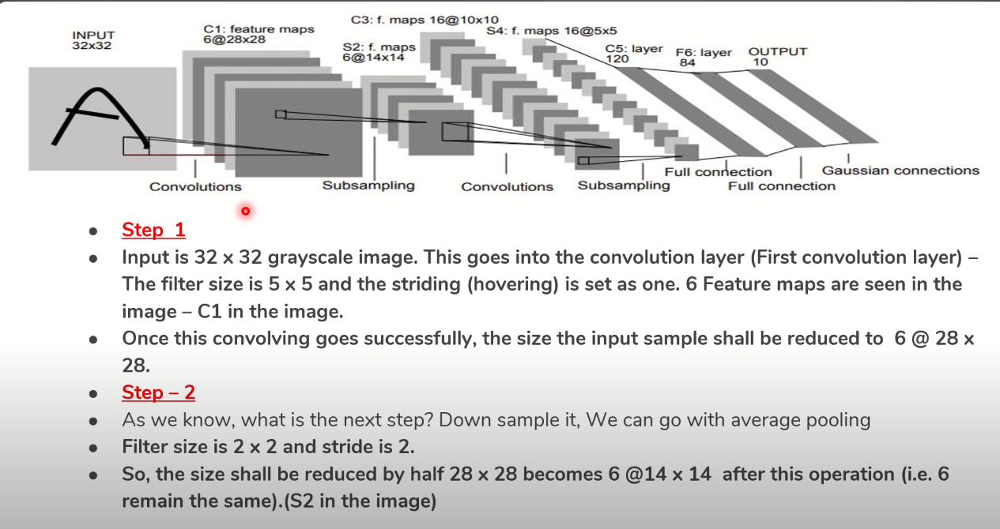{width="6.5in"
height="3.4375in"}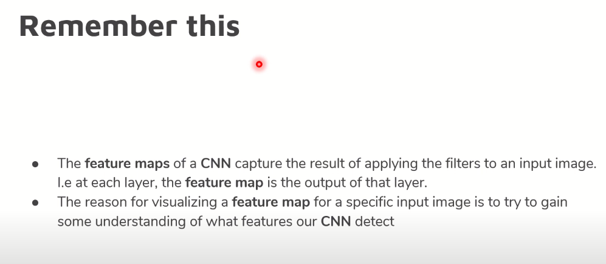{width="6.5in"
height="2.8229166666666665in"}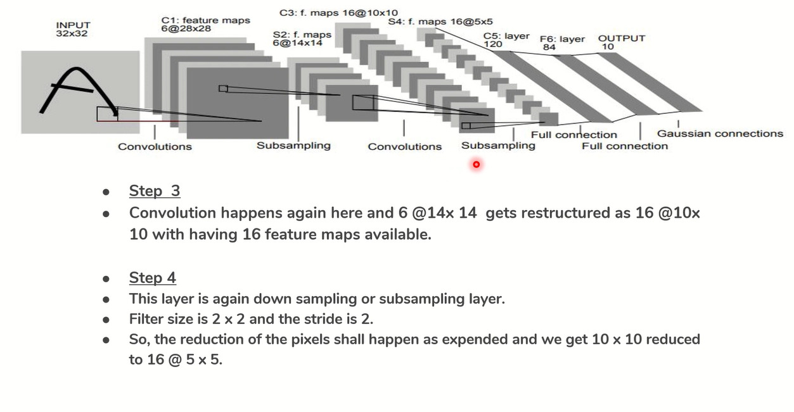{width="6.5in"
height="3.3645833333333335in"}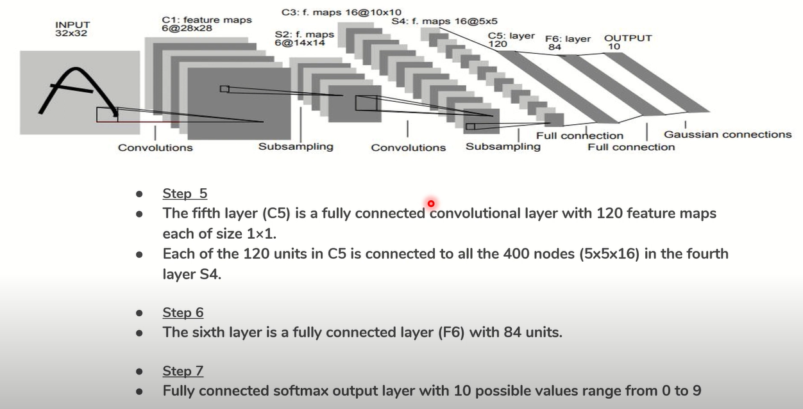{width="6.5in"
height="3.3125in"}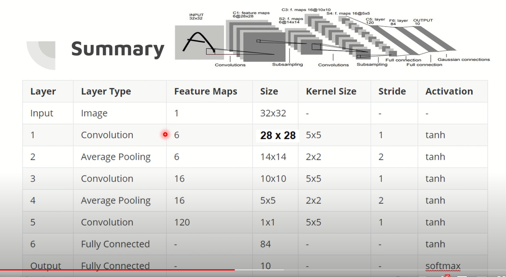{width="6.5in"
height="3.5625in"}

Code implementation of LeNet :

[LeNet with TensorFlow. LeNet is considered to be the ancestor... \| by
mrgrhn \| Analytics Vidhya \|
Medium](https://medium.com/analytics-vidhya/lenet-with-tensorflow-a35da0d503df)
